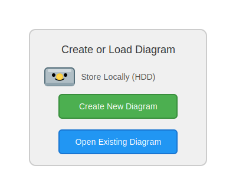

# Markdown-Spickzettel

Dieser Markdown-Spickzettel bietet eine schnelle Übersicht über die wichtigsten Markdown-Syntaxelemente. GitLab wird Ihnen standardmäßig die Ausgabe entsprechend formatiert im Browser darstellen (z.B. als Überschriften markierte Teile als HTML Überschriften). Laden Sie diesen Spickzettel herunter (Menüleiste, Knopf ganz rechts) und öffnen diesen in einem Texteditor oder schalten Sie in GitLab auf die Rohansich (Menüleiste, 2. Knopf von rechts, neben dem Herunterladen-Knopf) um damit Sie die zugehörigen Markdown Kommandos einsehen können. 

**Tipp**: Sie können Markdown Dokumente auch direkt in GitLab erstellen und editieren.

## Grundlegende Syntax

Dies sind die Elemente, die im ursprünglichen Design-Dokument von Markdown beschrieben sind. Alle Markdown-Anwendungen unterstützen diese Elemente.

### Überschrift

Um eine Überschrift zu erstellen, setzen Sie Nummernzeichen (#) vor ein Wort oder eine Phrase. Die Anzahl der verwendeten Nummernzeichen entspricht der Überschriftsebene. Zum Beispiel, um eine Überschrift der dritten Ebene (h3) zu erstellen, verwenden Sie drei Nummernzeichen (z. B. `### Meine Überschrift`).

# H1
## H2
### H3

### Fett

Um Text fett zu formatieren, fügen Sie zwei Sternchen oder Unterstriche vor und nach einem Wort oder einer Phrase hinzu. Um das Innere eines Wortes hervorzuheben, setzen Sie zwei Sternchen ohne Leerzeichen um die Buchstaben.

**fetter Text**

### Kursiv

Um Text kursiv zu formatieren, setzen Sie ein Sternchen oder einen Unterstrich vor und nach einem Wort oder einer Phrase. Um das Innere eines Wortes hervorzuheben, setzen Sie ein Sternchen ohne Leerzeichen um die Buchstaben.

*kursiver Text*

### Blockzitat

Um ein Blockzitat zu erstellen, setzen Sie ein `>` vor einen Absatz. Blockzitate können mehrere Absätze enthalten. Setzen Sie `>` auch vor leere Zeilen zwischen den Absätzen.

> Blockzitat
>
> Blockzitat

### Geordnete Liste

Sie können Elemente in geordnete und ungeordnete Listen organisieren.
Um eine geordnete Liste zu erstellen, setzen Sie Nummern gefolgt von einem Punkt vor die Listenelemente. Die Nummern müssen nicht in numerischer Reihenfolge sein, aber die Liste sollte mit der Zahl 1 beginnen.

1. Erstes Element
2. Zweites Element
3. Drittes Element

### Ungeordnete Liste

Um eine ungeordnete Liste zu erstellen, setzen Sie Bindestriche (-), Sternchen (*) oder Pluszeichen (+) vor die Listenelemente. Indentieren Sie ein oder mehrere Elemente, um eine verschachtelte Liste zu erstellen.

- Erstes Element
- Zweites Element
- Drittes Element

### Code

Um ein Wort oder eine Phrase als Code zu kennzeichnen, setzen Sie es in Backticks (`).

`code`

### Horizontale Linie

Um eine horizontale Linie zu erstellen, verwenden Sie drei oder mehr Sternchen (***), Bindestriche (---) oder Unterstriche (___) in einer eigenen Zeile.

---

### Link

Um einen Link zu erstellen, setzen Sie den Link-Text in eckige Klammern (z. B. `[GitLab]`) und fügen direkt danach die URL in runden Klammern hinzu (z. B. `(https://git01lab.cs.univie.ac.at/)`).

[GitLab](https://git01lab.cs.univie.ac.at/)

### Bild

Um ein Bild hinzuzufügen, setzen Sie ein Ausrufezeichen (!), gefolgt von alternativem Text in eckigen Klammern und dem relativen GitLab-Pfad zum Bild in runden Klammern. Sie können optional einen Titel in Anführungszeichen nach dem Pfad oder der URL hinzufügen.



## Erweiterte Syntax

Diese Elemente erweitern die grundlegende Syntax um zusätzliche Funktionen.

### Tabelle

Das Erstellen von Tabellen mit Bindestrichen und Pipes kann mühsam sein. Um den Prozess zu beschleunigen, versuchen Sie, Markdown-Tabellengeneratoren zu verwenden. Erstellen Sie eine Tabelle mit einer grafischen Oberfläche und kopieren Sie dann den generierten Markdown-Text in Ihre Datei.

| Syntax    | Beschreibung |
|-----------|-------------|
| Kopfzeile | Titel       |
| Absatz    | Text        |

### Abgegrenzter Codeblock

Die grundlegende Markdown-Syntax erlaubt es, Codeblöcke durch Einrücken mit vier Leerzeichen oder einer Tab-Taste zu erstellen. Alternativ können Sie abgegrenzte Codeblöcke verwenden. Hierfür drei Backticks \`\`\` in den Zeilen vor und nach dem Codeblock einfügen. Dann müssen auch keine Zeilen eingerückt werden. Syntax highlighting kann über den Wert (java, json, usw.) direkt nach dem ersten \`\`\` gesteuert werden.

```java
class HelloSE1 {
    public static void main(String[] args) {
        System.out.println("Hello, SE1!"); 
    }
}
```