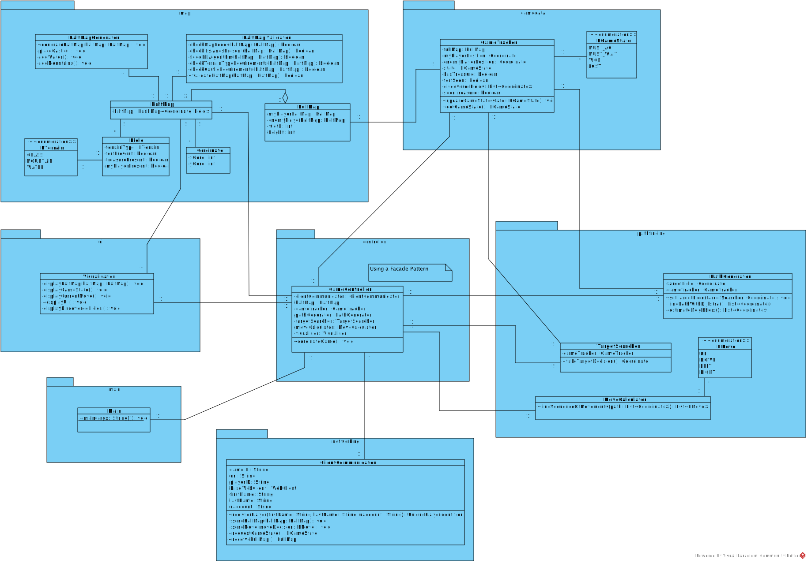
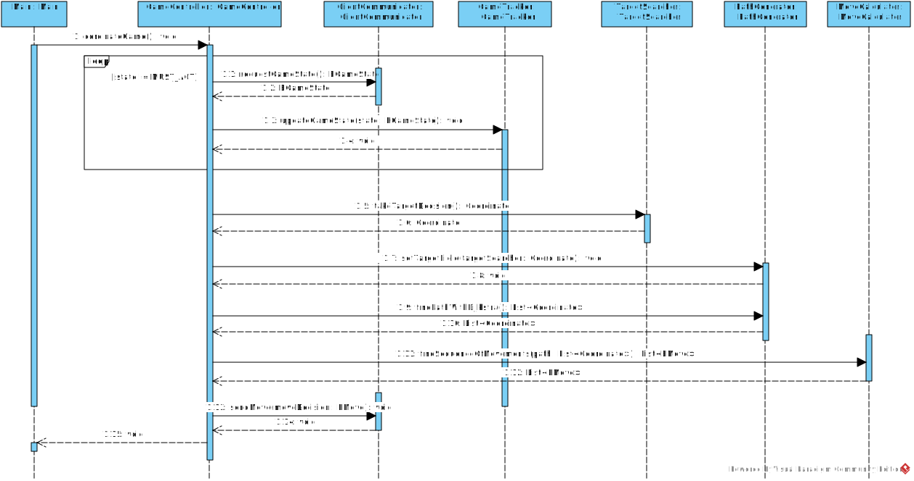
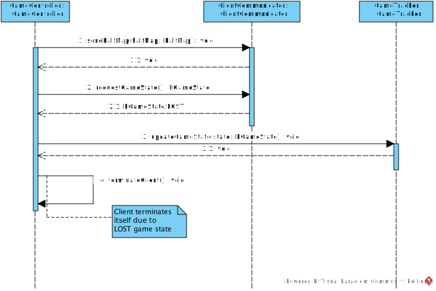

# Software Engineering I - Teilaufgabe 1 (Anforderungsanalyse und Planungsphase)

## Abgabedokument - Teilaufgabe 1 (Anforderungsanalyse und Planungsphase)

### Persönliche Daten, bitte vollständig ausfüllen:

- Nachname, Vorname: Tsvetkova, Nadezhda
- Matrikelnummer: 11942924
- E-Mail-Adresse: a11942924@unet.univie.ac.at
- Datum: 02.04.2025

## Aufgabe 1: Anforderungsanalyse

Analyse der Spielidee (Tipp: Netzwerkprotokolldokumentation kann zusätzlich beim Verständnis der Spielidee helfen) um 7 unterschiedliche Anforderungen (bestehend aus 3 funktionalen, 3 nichtfunktionalen und einer zusätzlichen Designbedingung) nach den folgenden Kriterien zu dokumentieren. Achten Sie darauf die in Skriptum und der Vorlesung behandelten **Qualitätsaspekten** (besonders: atomar, Aktor/System, Aktion, wann, standardisierte Schlüsselwörter) durchgehend zu berücksichtigen.

### Typ der Anforderung: funktional

**Anforderung 1**

- **Anforderung**: Kartenerstellung - Nachdem der Client für ein neues Spiel registriert hat, muss automatisch eine zufällige eigene Kartenhälfte erzeugen.
- **Bezugsquelle**: Spielidee, **"Die von den KIs bespielte Karte wird bei Beginn des Spiels von beiden beteiligten künstlichen Intelligenzen kooperativ erstellt. Hierzu erstellt jede der beiden KIs zufällig eine Hälfte der finalen Spielkarte…"**

**Anforderung 2**

- **Anforderung**: Schatzaufnehmen - Wenn der Client vom Server eine Nachricht über die Entdeckung des Schatzes bekommt, muss er seine Spielfigur bis zum entsprechenden Feld bewegen.
- **Bezugsquelle**: Spielidee, **"Sobald eine KI "ihren" Schatz gefunden bzw. aufgedeckt hat, muss sie ihre Spielfigur zu diesem bewegen, um ihn aufnehmen zu können."**

**Anforderung 3**

- **Anforderung**: Bewegungsbefehl senden – Der Client muss einen Bewegungsbefehl in eine gültige Richtung (UP, DOWN, RIGHT, LEFT) senden, sobald er laut Spielstatus (MUST_ACT) an der Reihe ist.
- **Bezugsquelle**: Spielidee, **"Eine KI darf aber keine Aktion setzen solange die andere KI an der Reihe ist."** und **"Die Spielfigur kann sich nur horizontal und vertikal zu direkt benachbarten Feldern bewegen…"**

### Typ der Anforderung: nicht funktional

**Anforderung 4**

- **Anforderung**: Reaktionszeit – Der Client muss innerhalb von 5 Sekunden pro Spielrunde die Entscheidung für seine Spielaktion treffen.
- **Bezugsquelle**: Spielidee, **„Für jede dieser rundenbasierten Spielaktion hat die KI maximal 5 Sekunden Bedenkzeit.“**

**Anforderung 5**

- **Anforderung**: Visualisierung des Spielzustands - Nach jeder Spielzustandsänderung erfolgt eine aktualisierte Darstellung durch CLI.
- **Bezugsquelle**: Spielidee, **„Während des Spiels müssen die Karte und deren bekannten Eigenschaften und wichtige Spielzustände von den Clients mittels command-line interface (CLI) für Anwender nachvollziehbar visualisiert werden. "**

**Anforderung 6**

- **Anforderung**: Einhaltung der Spiellogik – Der Client muss alle definierten Spielregeln einhalten, um eine automatische Niederlage zu vermeiden.
- **Bezugsquelle**: Spielidee, **"Der Server unterstützt dies, können Clients doch abfragen ob diese gerade an der Reihe sind. Bestraft (indem betroffene Clients verlieren) aber auch Clients die diese und andere Spielregeln nicht einhalten."**

### Typ der Anforderung: Designbedingung

**Anforderung 7**

- **Anforderung**: Architekturmodell - Das Spiel muss eine Client-Server-Architektur verwenden.
- **Bezugsquelle**: Spielidee, **Die Grobarchitektur ist damit als klassische Client/Server Architektur vorgegeben."**


## Aufgabe 2: Anforderungsdokumentation

Dokumentation einer zum relevanten Bereich passenden Anforderung nach dem vorgegebenen Schema. Ziehen Sie eine Anforderung heran, für die alle Bestandteile der Vorlage mit relevantem Inhalt sinnvoll befüllt werden können. Wir empfehlen hierzu eine **funktionale** Anforderung auszuwählen. Für diese lässt sich Aufgabe 2 in der Regel leichter umsetzen.

## Dokumentation Anforderung

- **Name**: Bewegungsbefehl senden
- **Beschreibung und Priorität**: Sobald der Client laut Spielstatus (MUST_ACT) an der Reihe ist, muss er automatisch einen Bewegungsbefehl an den Server senden. Der Bewegungsbefehl muss in eine der folgenden Richtungen sein - nach oben, unten, links oder rechts. Nachdem der Server die Bewegungsbefehl bekommen hat, aktualisiert er die Spieldaten. **Priorität:** Hoch
- **Relevante Anforderungen**: 
   - Reaktionszeit – Der Client muss innerhalb von 5 Sekunden pro Spielrunde die Entscheidung für seine Spielaktion treffen.
   - Einhaltung der Spiellogik – Der Client muss alle definierten Spielregeln einhalten, um eine automatische Niederlage zu vermeiden.
   - Architekturmodell - Das Spiel muss eine Client-Server-Architektur verwenden.
- **Relevante Business Rules**: 
   - Bewegungen müssen ausschließlich auf betretbare Felder (Wiese oder Berg) erfolgen.
   - Der Client muss einen Bewegungsbefehl senden, sobald er laut Server an der Reihe ist.
   - Bewegungen müssen abgebrochen werden, wenn sich die Spielfigur außerhalb der Kartengrenzen bewegen würde.
   - Ein Client darf nur dann einem Spiel beitreten, wenn er einen POST-Request mit der richtigen Spiel-ID und den vollständigen Information (Vorname, Nachname, u:account) sendet.

### Impuls/Ergebnis - Typisches Szenario

**Vorbedingungen:**

- Es wurde ein neues Spiel erstellt.
- Die Kartenhälften wurden bereits ausgetauscht.
- Die Spielfigur ist auf einem begehbaren Feld positioniert.
- Der Client ist laut Server an der Reihe.

**Hauptsächlicher Ablauf:**

1. **Impuls:** Die Client-KI berechnet die nächste Bewegungsrichtung.
   - **Ergebnis:** Der Client generiert einen Bewegungsbefehl.
2. **Impuls:** Der Bewegungsbefehl wird an den Server gesendet.
   - **Ergebnis:** Der Server prüft und bestätigt die Bewegung.
3. **Impuls:** Der Server übermittelt die neue Spielfigurposition.
   - **Ergebnis:** Die neue Position der Spielfigur wird visuell aktualisiert.

**Nachbedingungen:**

- Der Server erhöht um 1 die Anzahl der Runden, die der Client schon gespielt hat.
- Der andere Spieler ist an der Reihe.
- Die Umgebung wurde aktualisiert und neue Felder ggf. aufgedeckt.

### Impuls/Ergebnis - Alternativszenario

**Vorbedingungen:**

- Es wurde ein neues Spiel erstellt.
- Die Kartenhälften wurden bereits ausgetauscht.
- Der Client ist an der Reihe.
- Die Spielfigur steht neben einem Bergfeld.

**Hauptsächlicher Ablauf:**

1. **Impuls:** Der Client sendet Bewegungsbefehl nach der Richtung des Berges.
   - **Ergebnis:** Der Server registriert den ersten Schritt (Betreten hat begonnen).
2. **Impuls:** Das gleiche Bewegungsbefehl wird gesendet.
   - **Ergebnis:** Der Berg wird vollständig betreten.

**Nachbedingungen:**

- Die Spielfigur befindet sich auf dem Bergfeld.
- Der Server gibt Information dem Client darüber, ob Schatz oder Burg sich in einem der umliegenden Felder befindet. 
- Die Umgebung wurde aktualisiert und neue Felder ggf. aufgedeckt.

### Impuls/Ergebnis - Fehlerfall

**Vorbedingungen:**

- Es wurde ein neues Spiel erstellt.
- Die Kartenhälften wurden bereits ausgetauscht.
- Der Client ist nicht an der Reihe.

**Hauptsächlicher Ablauf:**

1. **Impuls:** Der Client sendet trotzdem einen Bewegungsbefehl.
   - **Ergebnis:** Der Server erkennt den ungültigen Versuch des Clients und eine Rückmeldung dem Client senden.
2. **Impuls:** Der Client empfängt eine Disqualifikationsmeldung vom Server.
   - **Ergebnis:** Der Client beendet das Spiel und zeigt „Niederlage“ an.

**Nachbedingungen:**

- Das Spiel wurde beendet.
- Der CLI zeigt den Verlust durch eine Meldung "You lost!".

### Benutzergeschichten

- Als Client möchte ich mich nur in erlaubte Richtungen bewegen, um gültige Züge auszuführen und das Spiel nicht zu verlieren.
- Als Client möchte ich nur dann Bewegungen senden, wenn ich an der Reihe bin, um Regelverstöße zu vermeiden.
- Als Server möchte ich Bewegungsbefehle validieren, um sicherzustellen, dass alle Clients regelkonform agieren.
- Als Anwender möchte ich, dass der Client Bewegungen visuell im CLI darstellt, damit ich den Spielfortschritt jederzeit nachvollziehen kann.

### Benutzerschnittstelle
- Die Spielkarte wird in einem CLI (Command Line Interface) dargestellt und enthält wichtige Informationen für den menschlichen Anwender: erkundete Felder, Terrainarten, Burg (Startposition), aktuelle Position und gegnerische Spielfigur. Die Darstellung aktualisiert sich nach jeder Aktion automatisch.

- Nachfolgend ein Beispiel für eine 10x10 Karte (aus zwei 5x10 Kartenhälften zusammengesetzt), bei dem der Spieler sich von der eigenen Burg (C) zum Feld rechts davon (P) bewegt hat:

``` 
Turn started.
Move command sent: Right
Moved from (4,4) to (4,5) – Terrain: Grass

Map (10x10):
     1     2   3    4    5    6    7     8   9    10
   +----+----+----+----+----+----+----+----+----+----+
 1 | W  | W  | G  | G  | G  | W  | W  |  W | G  | G  |
   +----+----+----+----+----+----+----+----+----+----+
 2 | W  | G  | G  | G  | M  | G  | W  | G  | C  | G  |
   +----+----+----+----+----+----+----+----+----+----+
 3 | G  | G  | M  | G  | G  | G  | G  | G  | G  | G  |   
   +----+----+----+----+----+----+----+----+----+----+   
 4 | G  | G  | G  | G  | P  | G  | G  | M  | G  | W  |
   +----+----+----+----+----+----+----+----+----+----+
 5 | G  | M  | G  | G  | G  | G  | G  | G  | G  | W  |
   +----+----+----+----+----+----+----+----+----+----+
 6 | W  | W  | W  | G  | W  | G  | G  | W  | G  | G  |
   +----+----+----+----+----+----+----+----+----+----+
 7 | G  | G  | M  | G  | G  | G  | G  | G  | G  | G  |
   +----+----+----+----+----+----+----+----+----+----+
 8 | G  | M  | G  | E  | G  | G  | W  | G  | W  | W  |
   +----+----+----+----+----+----+----+----+----+----+
 9 | W  | W  | G  | G  | G  | G  | G  | G  | G  | W  |
   +----+----+----+----+----+----+----+----+----+----+
 10| G  | W  | G  | G  | W  | G  | G  | W  | W  | W  |
   +----+----+----+----+----+----+----+----+----+----+

Legende: G = Grass, M = Mountain, W = Water, C = Castle, P = Player, E = Enemy

Discovered fields:
(2,9)=Castle, (3,9)=Grass, (3,8)=Grass, (3,7)=Grass, (3,6)=Grass, (3,5)=Grass, (4,5)=Player, (4,4)=Grass, (4,3)=Grass
Status: Not your turn – waiting...
```

### Externe Schnittstellen

- Netzwerkschnittstelle – Bewegungsübertragung:
   - Der Client muss über die Netzwerkschnittstelle eine Bewegung senden, sobald er laut Spielstatus an der Reihe ist. Dafür wird ein HTTP POST Request an den Endpoint http(s)://<domain>:<port>/games/<SpielID>/moves gesendet. Die Nachricht enthält eine XML-Nachricht mit der Spieler-ID (uniquePlayerID) und der Bewegungsrichtung (move), z. B. Right, Left, Up, Down, entsprechend dem XML-Schema aus dem Netzwerkprotokoll.
- Antwortschnittstelle des Servers: 
   - Der Server antwortet mit einer XML-Nachricht, die in einem responseEnvelope verpackt ist. Diese enthält den Status der Aktion (state=Okay oder Error) sowie im Fehlerfall eine Beschreibung (exceptionMessage). Erfolgreiche Bewegungen werden vom Server verarbeitet und wirken sich auf den Spielstatus aus, der vom Client regelmäßig abgefragt werden muss.
- Spezifikation der Kommunikationsschnittstelle: 
   - Der Nachrichtenaustausch basiert auf dem HTTP-Protokoll unter Verwendung von XML-Datenstrukturen. Für die Kommunikation muss der HTTP-Header accept=application/xml gesetzt werden. Eine stabile Internetverbindung während der Spielrunde ist erforderlich, da pro Runde maximal 5 Sekunden Bedenkzeit zur Verfügung stehen.

## Aufgabe 3: Architektur entwerfen, modellieren und validieren

### Klassendiagramm



### Sequenzdiagramm 1

Szenario 1: Beide Clients als fehlerfrei arbeitend annehmen. Aktuell ist der generische Client am Zug. Ihr Client hat derzeit noch nicht seinen Schatz gefunden. Planen und Modellieren Sie: Davon ausgehend das Berechnen und Übertragen der nächsten Bewegung Ihres Clients. 



### Sequenzdiagramm 2

Szenario 2: Annehmen, dass Ihr Client, versehentlich, gerade eine falsche Karte zum Server geschickt hat. Planen und Modellieren Sie: Beginnend mit dem Senden der Karte bis (inklusive) zur Terminierung der Clients.



## Aufgabe 4: Quellen dokumentieren

Dokumentieren Sie Ihre Quellen. Dies ist für Sie wichtig, um die Einstufung einer Arbeit als Plagiat zu vermeiden. Inhalte, die direkt aus dem Moodle Kurs dieses Semesters der LV Software Engineering 1 stammen, können zur Vereinfachung weggelassen werden. Alle anderen Inhalte sind zu zitieren. Die Vorgabe des Studienpräses der Universität Wien lautet: *"Alle fremden Gedanken, die in die eigene Arbeit einfließen, müssen durch Quellenangaben belegt werden."*

### Aufgabe 1: Anforderungsanalyse

- **Kurzbeschreibung der Übernommenen Teile**: Die Spielidee war die Grundlage für die Spiellogik, Ziele, Abläufe und zentrale Anforderungen. Das Netzwerkprotokoll habe ich zusätzlich genutzt, um die Kommunikation und den Ablauf zwischen Client und Server besser zu verstehen. Für die Einteilung der Anforderungen habe ich an den Folien, Arbeitsblättern und eigenen Notizen aus der VU SE1 WS24 und SS25 genutzt.
- **Quellen der Übernommenen Teile**: Spielidee, Netzwerprotokoll, Folien, Arbeitsblätter und eigene Notizen aus der VU Software Engineering 1 WS24 und SS25

### Aufgabe 2: Anforderungsdokumentation

- **Kurzbeschreibung der übernommenen Teile**: Ich habe die Spielidee und das Netzwerkprotokoll detaliert analysiert, um daraus die Szenarien, Regeln und Abläufe für das Senden von Bewegungsbefehlen abzuleiten. Für Struktur und Formulierungen habe ich mich am Beispiel aus dem Vorlagendokument orientiert.
- **Quellen der übernommenen Teile**: Spielidee, Netzwerprotokoll, Folien, Arbeitsblätter und eigene Notizen aus der VU Software Engineering 1 WS24 und SS25

### Aufgabe 3: Architektur entwerfen, modellieren und validieren

- **Kurzbeschreibung der übernommenen Teile**: Zur Umsetzung der Architektur habe ich externe Quellen aus dem Internet für ähnliche Beispiele und Beschreibungen, sowie meine eigene Notizen aus der Vorlesung und die UML-Folien aus der VU Modellierung genutzt, um die Client-Server-Struktur besser zu verstehen. Das UML-Tutorial von Visual Paradigm half mir bei der Darstellung.
- **Quellen der übernommenen Teile**: Spielidee, Netzwerprotokoll, Folien, Arbeitsblätter und eigene Notizen aus der VU Software Engineering 1 WS24 und SS25, VU Modellierung - UMLfolien SS21 https://medium.com/@paritosh_30025/client-server-architecture-from-scratch-java-e5678c0af6c9

https://dev.to/maddy/client-server-architecture-made-easy-with-examples-16cc

https://www.simplilearn.com/what-is-client-server-architecture-article

https://www.visual-paradigm.com/guide/uml-unified-modeling-language/uml-class-diagram-tutorial/

