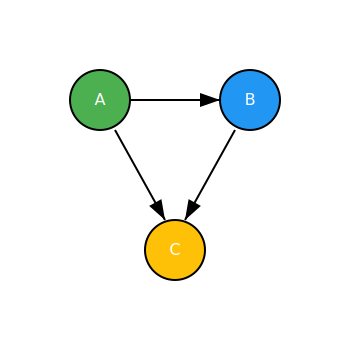
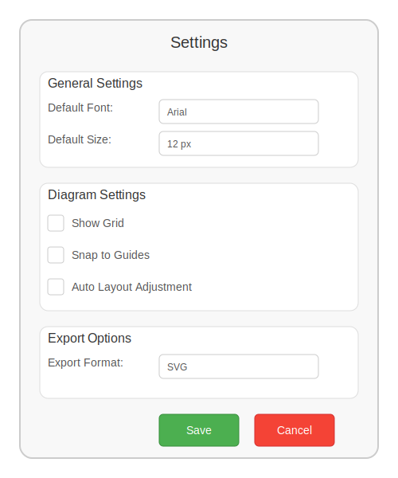

# Software Engineering I - Teilaufgabe 1 (Anforderungsanalyse und Planungsphase)

## Abgabedokument - Teilaufgabe 1 (Anforderungsanalyse und Planungsphase)

### Persönliche Daten, bitte vollständig ausfüllen:

- Nachname, Vorname: 
- Matrikelnummer: 
- E-Mail-Adresse: 
- Datum: 

Dieses Dokument dient als Vorlage für Teilaufgabe 1. Es muss zwingend hinsichtlich Aufbau, Markdown-Syntax und weiterer Vorgaben als Grundlage verwendet werden. Die abzugebenden Dokumente für Teilaufgabe 1 sowie alle Dokumente der nachfolgenden Teilaufgaben müssen vollständig in Markdown (für den Text) und SVG (für Diagramme) erstellt werden.

Die hier definierten Aufgabenstellungen stellen lediglich eine verkürzte und unvollständige Zusammenfassung der tatsächlichen Aufgabenstellungen dar. Sie ersetzen keinesfalls die Übungsangaben oder die darin festgelegten Anforderungen.

Diese Vorlage enthält Beispiele, die die erwarteten Inhalte und Ergebnisse verdeutlichen sollen. Entfernen Sie diese Beispiele vor der finalen Abgabe und fügen Sie Ihre eigenen Ausarbeitungen in die dafür vorgesehenen Bereiche ein. Weitere Beispiele und unterstützende Dokumente finden Sie in der Angabe auf Moodle.


## Aufgabe 1: Anforderungsanalyse

Analyse der Spielidee (Tipp: Netzwerkprotokolldokumentation kann zusätzlich beim Verständnis der Spielidee helfen) um 7 unterschiedliche Anforderungen (bestehend aus 3 funktionalen, 3 nichtfunktionalen und einer zusätzlichen Designbedingung) nach den folgenden Kriterien zu dokumentieren. Achten Sie darauf die in Skriptum und der Vorlesung behandelten **Qualitätsaspekten** (besonders: atomar, Aktor/System, Aktion, wann, standardisierte Schlüsselwörter) durchgehend zu berücksichtigen.

### Typ der Anforderung: funktional

**Beispielanforderung**

- **Anforderung**: Sprache des Programms – Beim ersten Start von SyncMobile muss im Logindialog als Sprache die Möglichkeit "English" vorausgewählt sein.
- **Bezugsquelle**: Unabhängiges Beispiel, bei den eigenen Lösungen bitte Spielidee Zitat angeben. Nur Anforderungen aus Spielidee sind relevant, da diese für die Übung die vom Kunden erhaltenen Informationen abbilden/sammeln.

**Anforderung 1**

- **Anforderung**: [Name plus Anforderung]
- **Bezugsquelle**: [Spielidee, **Zitat**]

**Anforderung 2**

- **Anforderung**: [Name plus Anforderung]
- **Bezugsquelle**: [Spielidee, **Zitat**]

**Anforderung 3**

- **Anforderung**: [Name plus Anforderung]
- **Bezugsquelle**: [Spielidee, **Zitat**]

### Typ der Anforderung: nicht funktional

**Anforderung 4**

- **Anforderung**: [Name plus Anforderung]
- **Bezugsquelle**: [Spielidee, **Zitat**]

**Anforderung 5**

- **Anforderung**: [Name plus Anforderung]
- **Bezugsquelle**: [Spielidee, **Zitat**]

**Anforderung 6**

- **Anforderung**: [Name plus Anforderung]
- **Bezugsquelle**: [Spielidee, **Zitat**]

### Typ der Anforderung: Designbedingung

**Anforderung 7**

- **Anforderung**: [Name plus Anforderung]
- **Bezugsquelle**: [Spielidee, **Zitat**]


## Aufgabe 2: Anforderungsdokumentation

Dokumentation einer zum relevanten Bereich passenden Anforderung nach dem vorgegebenen Schema. Ziehen Sie eine Anforderung heran, für die alle Bestandteile der Vorlage mit relevantem Inhalt sinnvoll befüllt werden können. Wir empfehlen hierzu eine **funktionale** Anforderung auszuwählen. Für diese lässt sich Aufgabe 2 in der Regel leichter umsetzen.

## Dokumentation einer Beispielanforderung - Thema ist unabhängig vom Übungsprojekt

- **Name**: Ablaufdiagramm erzeugen
- **Beschreibung und Priorität**: Der Anwender ist in der Lage ein Ablaufdiagramm zu erzeugen. Dieses wird vollautomatisch erzeugt. Einmal erzeugte Diagramme werden automatisch gespeichert.
- **Priorität**: Hoch

### Relevante Anforderungen

- **Webbasierte Darstellung**: Von Anwendern erstellte Diagramme entsprechen in Chrome, FireFox und Opera (Versionen des Jahres 2020/21) den im Anhang angeführten Beispieldarstellungen.
- **Speicheranforderung für Diagrammelemente**: Das in Abbildung 3 abgebildete Beispieldiagramm benötigt maximal 10KiB Speicherplatz in der Datenbank. 
- **Importmöglichkeiten**: Anwender können zuvor erstellte Diagrammexporte wiederherstellen.
- **Lizenzstatus**: Die durch Anwender nutzbaren Funktionen können mittels Lizenzen einzeln freigeschaltet werden.

### Relevante Business Rules

- Die Darstellung der Diagramme erfordert zumindest einen HTML5 fähigen Browser mit aktivieren Javascript. Ist dies nicht gegeben, wird der Anwender darauf hingewiesen und auf die Frontpage umgeleitet.
- Von Anwendern erstellte Diagramme dürfen eine Maximalgröße von 10MiB in der Datenbank nicht überschreiten. Beim Verstoß wird "Invalid Storage Space" als Warnung angezeigt.
- Importe sind nur für Exporte möglich, welche von Applikationsversionen erzeugt wurden, die bis zu maximal 2 Minorversionen zurückliegen. Anfragen an noch ältere Backups werden mit "Unknown Version" beantwortet.
- Zugriff auf die Daten ist nur nach erfolgreicher Authentifizierung (Benutzernamen und Passwort) möglich.

### Impuls/Ergebnis – Typisches Szenario

**Vorbedingungen**

- Der Anwender ist bereits über Single Sign On in das System eingeloggt.
- Die konfigurierte Lizenz erlaubt das Erstellen von Anwendungsdiagrammen von zumindest einem Anwender.

**Hauptsächlicher Ablauf**

1. **Impuls**: Der Anwender drückt auf das Icon, um das Diagramm Tool zu starten.
   - **Ergebnis**: Das System lädt das Diagramm Tool und erstellt dafür eine 2D Form. Die Form wird automatisch mit Buttons befüllt, mit welchen die Diagrammerstellung ausgelöst werden kann.
2. **Impuls**: Der Anwender startet das Diagramm Tool erstmalig.
   - **Ergebnis**: Das System wird beim Nutzer die Standardeinstellungen abfragen.
3. **Impuls**: Der Anwender stößt das Erzeugen eines neuen Ablaufdiagramms an.
   - **Ergebnis**: Das System erstellt vollautomatisch ein neues Ablaufdiagramm mit beispielhaften Inhalten.
4. **Impuls**: Ein neues Ablaufdiagramm wurde erstellt.
   - **Ergebnis**: Das System speichert automatisch das neue Ablaufdiagramm.

**Nachbedingungen**

- Das Ablaufdiagramm wurde in der Datenbank des Anwenders abgelegt.
- Der Anwender ist in der Lage, das Ablaufdiagramm im Dashboard einzusehen und zur wiederholten Bearbeitung zu öffnen.

### Impuls/Ergebnis - Alternativszenario

**Vorbedingungen**

- Der Anwender ist bereits über Single Sign On in das System eingeloggt.
- Die konfigurierte Lizenz erlaubt das Erstellen von Anwendungsdiagrammen von zumindest einem Anwender.

**Hauptsächlicher Ablauf**

1. **Impuls**: Der Anwender drückt auf das Icon, um das Diagramm Tool zu starten.
   - **Ergebnis**: Das System lädt das Diagramm Tool und erstellt dafür eine 2D Form. Die Form wird automatisch mit Buttons befüllt, mit welchen die Diagrammerstellung ausgelöst werden kann.
2. **Impuls**: Der Anwender startet das Diagramm Tool zum wiederholten Male.
   - **Ergebnis**: Das System lädt automatisch die Standardeinstellungen.
3. **Impuls**: Die Standardeinstellungen wurden geladen und erkannt, dass bereits an einem Ablaufdiagramm gearbeitet wurde.
   - **Ergebnis**: Das System lädt vollautomatisch das zuvor bearbeitete Ablaufdiagramm.
4. **Impuls**: Das zuvor erstellte Ablaufdiagramm wurde verändert.
   - **Ergebnis**: Das System speichert automatisch die am Ablaufdiagramm durchgeführten Änderungen.

**Nachbedingungen**

- Die am Ablaufdiagramm durchgeführten Änderungen wurden in der Datenbank des Anwenders abgelegt.
- Die Darstellung des Ablaufdiagramms im Dashboard spiegelt die durchgeführten Änderungen wider.

### Impuls/Ergebnis – Fehlerfall

**Vorbedingungen**

- Der Anwender ist bereits über Single Sign On in das System eingeloggt.
- Die konfigurierte Lizenz berechtigt den Anwender nicht zum Erstellen von Anwendungsdiagrammen.

**Hauptsächlicher Ablauf**

1. **Impuls**: Der Anwender drückt auf das Icon, um das Diagramm Tool zu starten.
   - **Ergebnis**: Das System lädt das Diagramm Tool und erstellt dafür eine 2D Form. Die Form wird automatisch mit Buttons befüllt, mit welchen die Diagrammerstellung ausgelöst werden kann.
2. **Impuls**: Der Anwender startet das Diagramm Tool erstmalig.
   - **Ergebnis**: Das System wird beim Nutzer die Standardeinstellungen abfragen.
3. **Impuls**: Der Anwender stößt das Erzeugen eines neuen Ablaufdiagramms an.
   - **Ergebnis**: Das System stellt fest, dass der Anwender hierzu nicht berechtigt ist.
4. **Impuls**: Ein Lizenzverstoß wurde festgestellt.
   - **Ergebnis**: Der Anwender wird auf eine fehlende Lizenz hingewiesen und der Kauf einer Lizenz nahegelegt.

**Nachbedingungen**

- Der Nutzungsversuch für die nicht lizenzierte Funktion wurde aufgezeichnet.
- Der Kundenbetreuer des betroffenen Anwenders wurde über den Lizenzverstoß informiert, um ein passendes Angebot aufzusetzen.

### Benutzergeschichten

- Als Anwender möchte ich ein neues Ablaufdiagramm vom System erstellen lassen, um die Diagramme nicht händisch zeichnen zu müssen.
- Als Anwender möchte ich, dass einmal erstellte Diagramme gespeichert werden, um zukünftig historische Entwicklungen nachvollziehen zu können.

### Benutzerschnittstelle

Darstellung der initialen Form, welche dazu dient, die Erstellung eines Diagramms auszulösen, sowie ein Beispiel für die visuelle Darstellung des Diagramms. Abschließend ein Beispiel für die Darstellung des initialen Konfigurationsdialogs, welches dazu dient, die Einstellungen des Tools beim ersten Start zu setzen.

|  |  |  |
|:-----------------------:|:-----------------------:|:-----------------------:|

### Externe Schnittstellen

- **Schnittstelle Datenbank**: Es wird eine Verbindung zur MySQL Datenbank aufgebaut und SQL verwendet, um einmal erstellte Diagramme in der Systemdatenbank abzulegen. Übertragen werden Diagramme als GraphObject mit Bestätigung des Empfanges mittels Rückmeldung der geänderte Zeilen.
- **Schnittstelle Diagrammdaten**: Es wird die LogSPX FTPS Schnittstelle verwendet, um alle Daten zur Erstellung der Ablaufdiagramme einzulesen. Die Verbindung ist SSL Verschlüsselt, wobei die Daten unter ftps://testserver.com/testfolder zu finden sind. Diagramme werden als UmlXML-Standard übertragen.

## Dokumentation Anforderung

- **Name**: [Namen der Anforderung (wenige Wörter)]
- **Beschreibung und Priorität**: [Geben Sie eine kurze Beschreibung (2-3 Sätze) der Anforderung an und definieren Sie die Priorität der Anforderung als: Hoch, Mittel, Niedrig]
- **Relevante Anforderungen**: [Geben Sie an welche funktionalen und nichtfunktionalen Anforderungen aus der vorangegangenen Aufgabe mit dieser detaillierteren Anforderungsdokumentation in Wechselwirkung stehen.]
- **Relevante Business Rules**: [Welche Regeln basierend aus den typischen Geschäftsalltag müssen für diese Anforderung berücksichtigt bzw. eingehalten werden, um diese korrekt umsetzen zu können? Es handelt sich hierbei um besondere Anforderungen. Daher Anforderungen für die explizit Prüflogik in den Code eingebaut würde bzw. werden muss um sicherzustellen, dass sich alle Beteiligten (z.B. der Client während der Kommunikation mit dem Server) an diese halten. Diese sind zumeist deshalb spezifischer als die Formulierung der Anforderungen. Im Falle der Übung stellt die Spielidee eine gute Quelle dafür dar da darin vermerkt ist wo, wann, warum und wie etwas validiert/geprüft wird.]

### Impuls/Ergebnis - Typisches Szenario

[Welche Schritte werden durchlaufen, um das der Anforderung zugehörige Verhalten auszulösen bzw. zu nutzen, und was ist das unmittelbare Ergebnis jedes Schrittes? Die Impuls-/Ergebnis-Pärchen entsprechend kennzeichnen. Mehrere aufeinander aufbauende bzw. zusammengehörige Pärchen definieren. Diese dienen dazu, den Stakeholdern relevante Abläufe, Bedingungen und Reihenfolgen zu verdeutlichen. Sich dieser Pärchen bewusst zu werden, hilft bei der späteren Architektur in Aufgabe 3 (z. B. wann wird welche Methode aufgerufen).] 

**Vorbedingungen:**

- [Stellen Sie sicher, dass erkennbar ist welche Schritte dazu führen, dass eine Anforderung relevant wird (Vorbedingungen).]

**Hauptsächlicher Ablauf:**

- [Schritte des Ablaufs beschreiben.]

**Nachbedingungen:**

- [Auch die Auswirkung des hauptsächlichen Ablaufs und die direkt anschließenden Schritte müssen angeführt werden (Nachbedingungen). Dies soll EntwicklerInnen verdeutlichen wie sich eine Anforderung in den typischen Programmablauf einbettet.]

### Impuls/Ergebnis - Alternativszenario

[Ein Alternativszenario, das vergleichbare Vorbedingungen (zum typischen Szenario) aufweist, jedoch sich im Ablauf und Nachbedingungen unterscheidet. Hilft sich Variationen und Verzweigungen im Ablauf bewusst zu werden.]. 

**Vorbedingungen:**

- [Stellen Sie sicher, dass erkennbar ist welche Schritte dazu führen, dass eine Anforderung relevant wird (Vorbedingungen).]

**Hauptsächlicher Ablauf:**

- [Schritte des Ablaufs beschreiben.]

**Nachbedingungen:**

- [Auch die Auswirkung des hauptsächlichen Ablaufs und die direkt anschließenden Schritte müssen angeführt werden (Nachbedingungen). Dies soll EntwicklerInnen verdeutlichen wie sich eine Anforderung in den typischen Programmablauf einbettet.]

### Impuls/Ergebnis - Fehlerfall

[Erwarteten Fehlerfall beschreiben und wie dieser gehandhabt wird. Dies ist besonders relevant, da ansonsten nur Gutfälle berücksichtigt werden was im Produktiveinsatz schnell nicht mehr ausreichend ist.]

**Vorbedingungen:**

- [Stellen Sie sicher, dass erkennbar ist welche Schritte dazu führen, dass eine Anforderung relevant wird (Vorbedingungen).]

**Hauptsächlicher Ablauf:**

- [Schritte des Ablaufs beschreiben, insbesondere wie der Fehler entstanden ist und wie er behandelt wird.]

**Nachbedingungen:**

- [Auch die Auswirkung des hauptsächlichen Ablaufs und die direkt anschließenden Schritte müssen angeführt werden (Nachbedingungen). Dies soll EntwicklerInnen verdeutlichen wie sich eine Anforderung in den typischen Programmablauf einbettet.]

### Benutzergeschichten

- [Zugehörige User Stories, welche die Anforderung genauer beschreiben mit folgendem Aufbau: Als \<Rolle> möchte ich \<Ziel/Wunsch> um s folgendes \<Nutzen> zu erreichen. Geeignete Rollen wären: (Menschlicher) Anwender, Client, KI oder Server. Darauf achten alle drei Themen abzudecken (Rolle, Ziel, Nutzen).]

### Benutzerschnittstelle

- [Geben Sie hier ein Beispiel/Mockup für die zugehörige Benutzerschnittstelle an, um darzustellen welchen Einfluss diese Anforderung auf die CLI Benutzeroberfläche hat. Dies soll Ihnen ermöglichen schon vor dem Entwurf festzustellen was und wie Informationen in einer Anwendung dargestellt werden – was wiederum beim späteren Entwurf der Architektur hilft. Da nur CLI verlangt ist kann das Beispiel/Mockup einfach als Text in dieses Dokument eingegeben werden. **Tipp:** Verwenden Sie in Markdown Code-Blöcke mit drei Backticks \`\`\` oder \` für Inline-Code. Dies sorgt für eine dicktengleiche Schrift (alle Zeichen haben identische Maße).]
-  ```
   First A B C 
   Second Step
   And Something More
   ```
- `Let's goooo!`

### Externe Schnittstellen

- [Beschreiben Sie hier kurz die für die gewählte Anforderung bzw. dessen Realisierung relevanten Schnittstellen zu externen Systemen. 1-2 Sätze je Schnittstelle mit Informationen zu den ausgetauschten Informationen, Netzwerkverbindungen, Protokollen, wesentliche Daten, Beschränkung usw. (siehe Netzwerkprotokoll) die EntwicklerInnen erkennbar machen sollen wie mit den Schnittstellen interagiert werden muss. In Blick in das Netzwerkprotokoll soll so abgekürzt oder sogar vermieden werden können während der Entwicklung.]

## Aufgabe 3: Architektur entwerfen, modellieren und validieren

### Klassendiagramm

[Klassendiagramm hier samt, bei Bedarf, Beschreibung beziehungsweise Erläuterung einfügen]

### Sequenzdiagramm 1

[Sequenzdiagramm 1 hier samt, bei Bedarf, Beschreibung beziehungsweise Erläuterung einfügen]

### Sequenzdiagramm 2

[Sequenzdiagramm 2 hier samt, bei Bedarf, Beschreibung beziehungsweise Erläuterung einfügen]

### Empfehlungen zur Umsetzung:

Überlegen Sie sich und modellieren Sie händisch (daher z.B. nicht aus Code generiert oder abgemalt) alle notwendigen Packages, Klassen und deren Methoden/Konstruktoren (samt Daten und Beziehungen) als UML Klassendiagramme.

Es empfiehlt sich hierbei zuerst frei Hand - auf Papier oder digital - erste Ideen und Überlegungen festzuhalten, Listen potentieller Objekte zu erzeugen, usw. Danach, erst wenn ein grober Plan steht, diese dann digital in UML zu übertragen. Eine Anleitung/Empfehlung zum Vorgehen finden Sie in der Angabe und auch (samt Beispielanwendung) im dort verlinkten Skriptum.

Achten Sie darauf, dass die Modelle sinnvoll benannte Packages, **Klassen & deren Beziehungen**, **Konstruktoren** (inkl. Parameter), **Methoden** (inkl. Parameter und Rückgaben) und **Felder** beinhalten und die Vorgaben der Spielidee bzw. des Netzwerkprotokolls vollständig in sinnvoller Granularität abgedeckt werden. Parameter und Rückgabetypen sind wichtig, um den Datenfluss abzubilden und stellen auch eine wesentliche Basis für die Sequenzdiagramme dar.

**Basierend auf dem Klassendiagramm**: Erstellen Sie Sequenzdiagramme zu den in der Übungsangabe vorgegebenen Szenarien. Alle erstellten Diagramme sollten semantisch und syntaktisch korrekt sowie untereinander konsistent sein.

**Erwartungshaltung und Vorgehen**: Es wird kein 100% korrektes UML-Diagramm entstehen, das ohne jede Änderung direkt implementiert werden kann. Dies wird auch nicht erwartet und hätte viele Nachteile (Verbesserungspotential wird hinter Details "versteckt", Änderungen aufwändig und damit Iterationen verunmöglicht, etc.)

Es gilt, sich mit den Unterlagen (Spielidee, Netzwerkprotokoll) zu beschäftigen und eine Softwarestruktur zu erstellen. Diese Struktur soll am Ende der Angabe a) keine wesentlichen oder explizit festgelegten Use Cases vergessen und b) die erkannten Use Cases grundlegend ausführbar abbilden. Letzteres z.B. indem Methoden vorgesehen sind, und die Methoden Zugriff auf die wesentlichsten Daten erhalten (z.B. mit Parametern). Der konkrete Algorithmus in der Methode ist dabei nicht relevant (siehe Übungstutorial: Was vs. Wie). Bei den Daten ist der Fokus auf das Wesentliche für uns wichtig, daher die Daten, die in jeder möglichen Implementierungsform jedenfalls notwendig wären. Beispiel Netzwerk: Unabhängig vom Algorithmus und der konkreten Implementierung der Netzwerkklasse wird es den Use Case Kartenhälftenversand immer geben. Dieser wird immer Informationen über die Kartenhälfte benötigen. 

Trotz dieser Vereinfachungen und Abstraktion wird nach 1x Angabe lesen kaum direkt das finale UML-Diagramm gezeichnet werden. Tipp zum Vorgehen: Lesen Sie die Spielidee. Teilen Sie alles in kleinere Themen ein (Groß zu Klein). Beginnend mit „Client“ dann Packages wie Map, dann Klassen wie GameMap und Methoden bzw. Verben wie extractTreasureCoordinate. Pro Abstraktionsebene die Daten festlegen, die ein- bzw. ausgehen. Ein gutes Beispiel hierfür bieten, unter anderem, die VO-Inhalte zum Thema Divide and Conquer und die Übungstutorials.

Dabei immer wieder prüfen, welche Inhalte pro Ebene vorhanden sind. Sind dies zu viele, dann aufteilen. Beispielsweise könnte theoretisch alles über die Karte in einer Klasse GameMap landen (Speicherung, Generierung, etc. daher viele Verben). Wir hätten jedoch gerne Single Responsibility und lagern deshalb Speicherung in eine MapStorage Klasse und die Erstellung in eine MapGenerator Klasse aus. Nun erneut prüfen, welche Funktionen (Verben) vorhanden sind pro Klasse und vermutlich werden sich die zuvor genannten Klassen sogar noch weiter unterteilen (wäre zumindest zu empfehlen).

Die Sequenzdiagramme sollen dabei helfen, die zuvor angestellten Überlegungen und erstellten Strukturen zu prüfen auf a) Abdeckung der Use Cases und b) Ausführbarkeit. Denken Sie sich durch und modellieren Sie, wie Ihr Klassendiagramm diese abdeckt und sich bei Java-Code-Ausführung verhalten würde. Merken Sie, dass das UML so technisch nicht funktionieren kann, wenn Sie einen vorgegebenen Use Case durchdenken, dann das Klassendiagramm ändern bzw. verbessern. Diese Situation wird mehrfach passieren und mehrere Zyklen sind absolut erwartet und in Ordnung.

### Wir bieten hierzu Unterstützung:

- Wie man die Modellierung und den Entwurf einer Architektur angeht, wird im zugehörigen Tutorial besprochen samt einer Ausgangsbasis für den Client. Sie können diese Ausgangsbasis gerne aufgreifen. Erweitern und ergänzen Sie diese dann mit eigenen Überlegungen und fehlenden Details. Zum Nachlesen ist in der Angabe ein passendes Skriptum mit Beispielentwurf und Empfehlungen zum Entwurf (Best Practices) hinterlegt. Wenn Sie Ihr UML-Modellierungswissen ausbauen möchten/müssen, wird im Skriptum zusätzlich auch dazu passende Literatur referenziert.

- Beachten Sie zur Ausarbeitung das auf Moodle zur Verfügung gestellte, auszugsweise abgebildete Diagrammbeispiel. Dieses dient als Vorlage und verdeutlicht, welche Erwartungen an das Klassendiagramm beziehungsweise die dazugehörigen Sequenzdiagramme gestellt werden (Darstellung, Inhalte, Detailgrad etc.) und wie diese beiden Diagrammarten zusammenhängen. Geforderte Sequenzdiagramme müssen die Interaktion Ihrer Klassen aus Ihrem Klassendiagramm für die angegebenen Szenarien zeigen.

- Für die Modellierung der für das Netzwerk relevanten Klassen gibt es im Netzwerkprotokoll auf Moodle eine Anleitung. Es ist nicht notwendig, Netzwerknachrichten als Datenklassen in die Diagramme aufzunehmen. Wenn diese an einer Stelle genutzt werden (z.B. als Parameter), kann der Name der Klassen als Typ angeführt werden. **Empfehlung**: Eigene auf konkrete Use Cases spezialisierte (und deshalb besser geeignete) Datenklassen zu erstellen, statt nur die bereitgestellten Netzwerkklassen zu „kopieren“, da diese nur auf den reinen Datenaustausch fokussiert sind. Im Netzwerkprotokoll wird auch der Ablauf (Wer, Wann, Was) der Interaktion zwischen Clients/Server dargestellt. Nützen Sie das, um diesen nachvollziehen und vor allem um diesen Ablauf auch in den Diagrammen zu berücksichtigen und auch nicht Wesentliches für die Sequenz- und Klassendiagramme zu übersehen.

Alle Diagramme in dieses Kapitel einfügen. Bei Bedarf mit einer kurzen Beschreibung. Als Dateiformat **immer SVG** nützen, dieses verlustlose Vektorformat (**keine** Rastergrafiken nützen) ist für UML sehr gut passend. Die Diagramme als separate SVG Dateien im Dokumentationsordner der Teilaufgabe 1 (siehe, GitLab Repository) ablegen (Namensvorgaben aus der Angabe beachten) und dann in dieses Dokument einbinden. Ein Markdown-Syntaxbeispiel dafür bietet das Beispiel zu Aufgabe 2 in diesem Dokument. Achten Sie bei der Verwendung von SVG Dateien darauf, dass sich diese fehlerfrei darstellen lassen. Als Referenz für die Anzeige ziehen wir den Renderer von Chrome/Chromium heran.

## Aufgabe 4: Quellen dokumentieren

Dokumentieren Sie Ihre Quellen. Dies ist für Sie wichtig, um die Einstufung einer Arbeit als Plagiat zu vermeiden. Inhalte, die direkt aus dem Moodle Kurs dieses Semesters der LV Software Engineering 1 stammen, können zur Vereinfachung weggelassen werden. Alle anderen Inhalte sind zu zitieren. Die Vorgabe des Studienpräses der Universität Wien lautet: *"Alle fremden Gedanken, die in die eigene Arbeit einfließen, müssen durch Quellenangaben belegt werden."*

### Aufgabe 1: Anforderungsanalyse

- **Kurzbeschreibung der Übernommenen Teile**: *Was & Wo im Projekt, In welchem Umfang (Idee, Konzept, Texte, Grafik etc.) mit und ohne Anpassungen, etc.*
- **Quellen der Übernommenen Teile**: *Folien, Bücher, Namen der Quell-Studierenden, URLs zu Webseiten, KI Prompts, etc.*

### Aufgabe 2: Anforderungsdokumentation

- **Kurzbeschreibung der übernommenen Teile**: 
- **Quellen der übernommenen Teile**: 

### Aufgabe 3: Architektur entwerfen, modellieren und validieren

- **Kurzbeschreibung der übernommenen Teile**: 
- **Quellen der übernommenen Teile**: 
